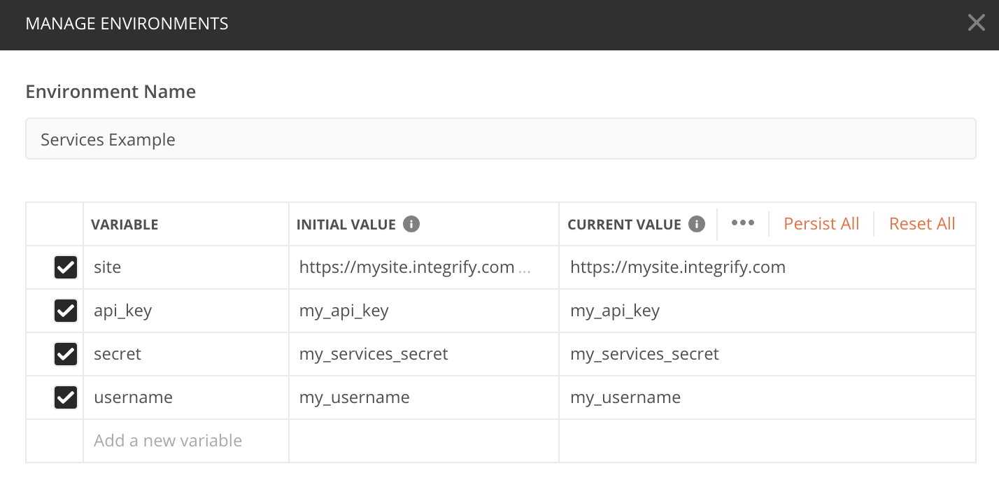
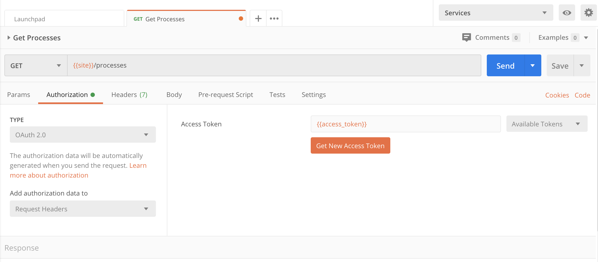

# Integrify API Tutorial

## Using the Integrify API Postman Collection

This Postman collection contains example requests and responses for the Integrify API. There are example request and payloads for some of the most commonly used requests. 
For most commands the smallest possible payload is given. Please find optional fields in the related official documentation. 

Please see here for [Developer Documentation](http://developer.integrify.com/)

Feel free to clone and modify this collection to your needs.

## Prerequisites
To use this collection in Postman please perform the following steps:

1. Download and install the Postman Client
2. [Activate](https://developer.integrify.com/rest/activation) the API on your Integrify Project 
3. Import the [collection.json](https://github.com/ebonertz/integrifyapitutorials/blob/master/tutorial/uploadfile.postman_collection.json)
4. Obtain your API Key and Secret from your project administrator 


## Setup Your Environment Variables

To automate frequent tasks the collection automatically manages commonly required values and parameters such
as resource ids, keys and versions in Postman Environment variables for you.

In Postman Create a new Environment for your Integrify Project

https://learning.postman.com/docs/postman/collection-runs/using-environments-in-collection-runs/

We recommend saving your variables at the environment level but you also have the option to use collection level variables or global variables

Your Environment in Postman should look like this

The required variables are as follows:

site: <https://mysite.integrify.com>

api_key: <mysite_api> (this is usually just your site name followed my "_api")

secret: <my_secret> (for v7 this secret mus be obtained from support@integrify.com)

username: <my_username>



## Obtain your Access Token
The first example in the collection is "Obtain Your Access Token with Impersonate"
You can reference the documentation about Impresonate and the Access endpoint 
[here](https://developer.integrify.com/rest/Access)

As shown in the image above you must incldude your api_key, secret, and username to get your access token

A successfull call should return a 200 Status and the response contains your access token which will be stored as an environment variable through the test scripts in the collection. 

```javascript
{"token":"1234accesstoken","token_type":"access","key":"my_api_key"}
```

For our collection we use the Auth 2.0 configruation in Postman and enter the Access Token Variable 



## Test the other queries in the Collection
Once you have your access token you are free to try any of the other requests in the collection.


